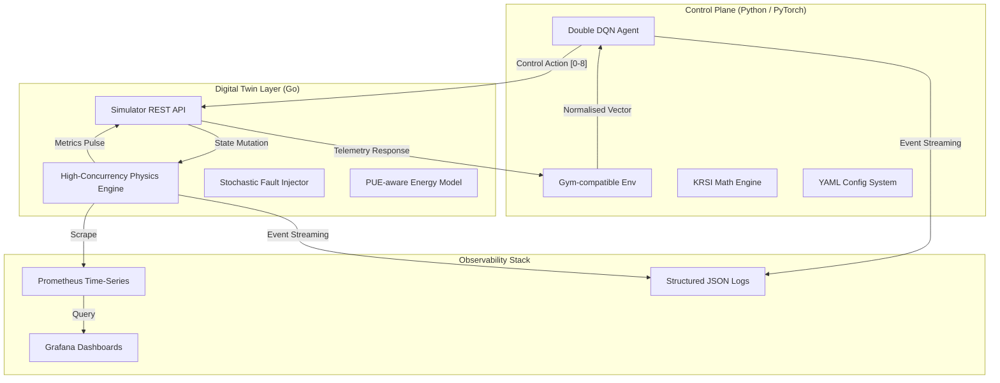

# KRSI: Kubernetes Resilience-Sustainability Index & Optimisation Framework

[](https://github.com/arch-duk3/kubernetes-relilience-sustainability-index-and-optimisation-framework/actions)
[](https://github.com/arch-duk3/kubernetes-relilience-sustainability-index-and-optimisation-framework/actions)
[](https://golang.org/)
[](https://www.python.org/)
[](https://opensource.org/licenses/MIT)
[](https://kubernetes.io/)

> **A Research-Grade Digital Twin for Autonomous Cloud-Native Resilience and Sustainability Engineering.**

KRSI is an infrastructure engineering platform designed to model, simulate, and optimise the complex tradeoffs between **Operational Resilience** and **Carbon Sustainability** in Kubernetes environments. Built as a decoupled digital twin, it combines a high-concurrency Go simulation engine with a PyTorch-driven Reinforcement Learning (RL) controller to achieve autonomous, multi-objective cluster optimisation.

---

##  High-Level Architecture

KRSI follows a production-grade decoupled architecture, isolating simulation physics from control logic to enable high-fidelity experimentation and scalable RL training.



### Component Breakdown
-   **Simulator (Go)**: Models Kubernetes pod dynamics, node failures, and diurnally-varying workloads. Implements a PUE-aware energy model and a correlated failure risk engine.
-   **Controller (Python)**: Implements a Double DQN (DDQN) agent with experience replay, gradient clipping, and a heuristic safety-override for critical resilience breaches.
-   **KRSI Math Engine**: Implements the mathematical specification for the Resilience-Sustainability Index (§8.3–§8.10), using adaptive inverse-variance weighting to handle noisy telemetry.

---

##  Attack-Defense & Chaos Engineering

KRSI isn't just a simulator; it's a security playground. It enables the evaluation of autonomous remediation policies against a variety of infrastructure and security threats.

### Adversarial Workflow
1.  **Injection**: Stochastic injection of "Adversarial Events" (Privilege Escalation, Lateral Movement, Resource Exhaustion).
2.  **Detection**: Detection latency is modeled as a function of the attack severity and cluster state.
3.  **Remediation**: The RL agent or Heuristic controller executes scaling (Replica/Node) or scheduling (Binpack/Spread) changes to isolate or absorb the attack.
4.  **Evaluation**: The impact is measured in real-time via the **Adversarial Resilience** sub-metric ($R_{adv}$).

### Chaos Engineering Capabilities
-   **Pod Failure Cascades**: Randomly killed replicas based on cluster pressure.
-   **Resource Starvation**: Sinusoidal workload bursts that test scheduler limits.
-   **API Instability**: Simulated control plane latency.
-   **Node Pressure**: CPU throttling and memory pressure events.

---

##  The KRSI Metric System

The **Kubernetes Resilience-Sustainability Index** is a multi-dimensional harmonic mean designed to provide a single "North Star" metric for cluster health.

| Dimension | Metrics Tracked |
| :--- | :--- |
| **Resilience ($R$)** | Uptime ($A$), Reliability ($R_{rel}$), Recovery Time ($R_{rec}$), Performance Impact ($R_{perf}$), Adversarial Resistance ($R_{adv}$). |
| **Sustainability ($S$)** | Energy Efficiency ($E_{eff}$), Carbon Intensity Weighting ($CIW$), Utilization Band ($U_{band}$), Renewable Energy Fraction ($Ren$). |

---

##  Observability: SRE Dashboards

KRSI exports production-grade telemetry to Prometheus, enabling high-resolution analysis of optimisation trajectories.

| Metric | Description |
| :--- | :--- |
| `krsi_resilience_trajectory` | Real-time composite resilience score. |
| `krsi_carbon_efficiency` | gCO2 emitted per unit of useful work processed. |
| `krsi_rl_reward_convergence` | Convergence dynamics of the DDQN agent. |
| `krsi_sla_violations_total` | Cumulative count of latency breaches (>50ms). |

> [!TIP]
> Use `make docker-up` to launch the pre-configured Grafana dashboard at `http://localhost:3000`.

---

##  Deployment & Execution

###  Docker Compose (Full Stack)
The fastest way to evaluate KRSI with full observability:
```bash
make docker-up
```

### ☸ Kubernetes (Helm)
Deploy the simulator as a service in your cluster:
```bash
helm install krsi ./deploy/helm/krsi
```

###  Running Experiments
Execute a reproducible experiment suite across multiple seeds:
```bash
python -m controller.train --config configs/default.yaml
```

---

##  Roadmap

### Short-Term
- [ ] **Multi-Agent RL**: Cooperative agents for node and pod-level control.
- [ ] **GNN-based State Representation**: Graph Neural Networks for cluster topology awareness.
- [ ] **Extended Attack Library**: Implementation of MITRE ATT&CK for Cloud simulation.

### Long-Term
- [ ] **Live Cluster Bridge**: Connect the controller to real EKS/GKE clusters via `kubectl`.
- [ ] **Auto-Generated Post-Mortems**: LLM-assisted analysis of simulation failure cascades.
- [ ] **Federated Learning**: Collaborative training across multiple digital twins.

---

##  Research & Attribution

If you use this framework for your research, please cite:
```bibtex
@software{krsi_framework_2026,
  author = {Archduke},
  title = {KRSI: Kubernetes Resilience-Sustainability Index & Optimisation Framework},
  url = {https://github.com/arch-duk3/kubernetes-relilience-sustainability-index-and-optimisation-framework},
  year = {2026}
}
```

---
